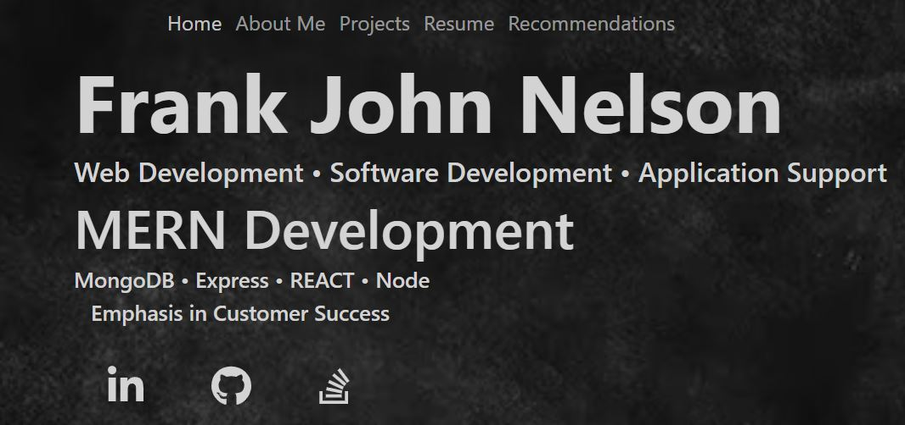

  
  
  
  
   

## Table of Contents (Optional)

- [Portfolio](#Portfolio)
- [Description](#Description)
- [Hosting](#Hosting)
- [Screenshot](#Screenshot)
- [Installation](#Installing)
- [License](#License)
# Portfolio

This project was bootstrapped with [Create React App](https://github.com/facebook/create-react-app).


Portfolio: https://johnne.netlify.app/

## Description

Bootcamp: Module 20 Challenge <br />
React Challenge: React Portfolio <br />
Codebase correction that follows accessibility standards so that the site is optimized for search engines <br />


## Hosting
Netlify hosting: https://johnne.netlify.app/


## Screenshot




## Installing & Setup

If you're looking at hosting this locally, you'll need to install NodeJS.

```shell
$ npm install
$ npm start
```
## License

Please refer to the LICENSE in the repo.
